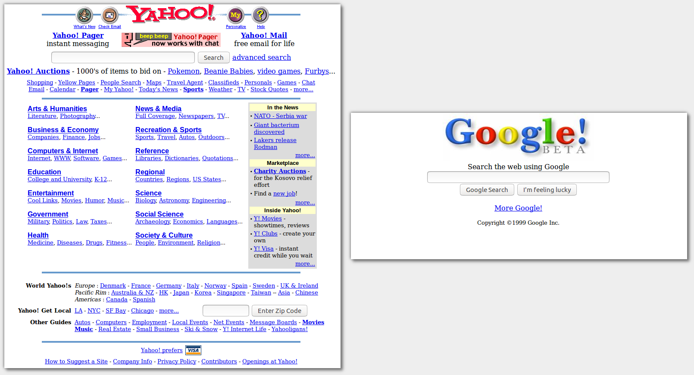

% Usabilidad Web
% Adolfo Sanz De Diego
% Septiembre 2017

# El autor

## Adolfo Sanz De Diego

- Empecé **desarrollando aplicaciones web**, hasta que di el salto a la docencia.

- Actualmente soy **Asesor Técnico Docente** en el servicio TIC de la D.G de Infraestructuras y Servicios de la Consejería de Educación, Juventud y Deporte de la Comunidad de Madrid.

- Además colaboro como **formador especializado en tecnologías de desarrollo**.

## Algunos proyectos

- **Hackathon Lovers** <http://hackathonlovers.com>: un grupo creado para emprendedores y desarrolladores amantes de los hackathones.

- **Password Manager Generator** <http://pasmangen.github.io>: un gestor de contraseñas online.

- **MarkdownSlides** <https://github.com/asanzdiego/markdownslides>: un script para crear slides a partir de ficheros MD.

## ¿Donde encontrarme?

- Mi nick: **asanzdiego**

    - AboutMe:  <http://about.me/asanzdiego>
    - GitHub:   <http://github.com/asanzdiego>
    - Twitter:  <http://twitter.com/asanzdiego>
    - Blog:     <http://asanzdiego.blogspot.com.es>
    - LinkedIn: <http://www.linkedin.com/in/asanzdiego>
    - Google+:  <http://plus.google.com/+AdolfoSanzDeDiego>

# Introducción

## ¿Qué?

- Vamos a ver qué es la **usabilidad de un sitio web y como mejorarla**.

## ¿Por qué?

- **Un caso real**: después de ser rediseñado prestándose especial atención a la usabilidad, el sitio web de IBM incrementó sus ventas en un 400%

# Glosario de términos

## Usabilidad

- La usabilidad se refiere a la capacidad de un software de ser **comprendido, aprendido, usado y ser atractivo para el usuario**, en condiciones específicas de uso. (ISO/IEC 9126)

- La usabilidad se refiere al **grado de eficacia, eficiencia y satisfacción** con la que un producto permite alcanzar objetivos, a usuarios, en un contexto de uso específico. (ISO/IEC 9241)

## Accesibilidad

- La accesibilidad se refiere a la capacidad del sistema a para **facilitar el acceso a todas las personas** en igualdad de condiciones, independientemente de la tecnología o soporte que utilicen y de la discapacidad que puedan presentar.

## Arquitectura Información

- Disciplina que busca **organizar espacios de información** con el fin de ayudar a los usuarios a satisfacer sus necesidades de información.

- El objetivo principal es **facilitar al usuario la recuperación de información**.

## Experiencia Usuario

- Capacidad de una interfaz de **generar sensaciones y emociones**, en el usuario, durante el proceso de interacción.

## Diseño Centrado Usuario

- Proceso de diseño y desarrollo (del sitio web) **conducido por el usuario**, sus necesidades, características e intereses.

# Conocer al usuario

## ¿Cómo ve?

- Un elemento con **mayor tamaño**, con un **color distinto**, con una **orientación diferente**, o **en movimiento**, tendrá más probabilidad de atraer nuestra atención.

## ¿Cómo piensa?

- Un usuario será capaz de identificar la función de cada elemento sólo **si ha aprendido previamente su significado**.

- Además **el significado dependerá del contexto**. (“Archivos”, tendrá distinto significado en una web de noticias que en una tienda de informática).

## ¿Cómo actúa?

- Normalmente empleamos el **sistema intuitivo pues nos permite economizar nuestro esfuerzo cognitivo**, y sólo usamos  **sistema racional para las decisiones realmente importantes**.

- No todo a lo que atendemos es procesado racionalmente, lo que **nos lleva a cometer errores** frecuentemente.

# Evitar errores

## Limitar posibilidades

- Siempre hay que tener en cuenta que cuantas menos opciones, menos posibilidades de error tendrá el usuario.

## Orientar al usuario

- Ya sea mostrándole paulatinamente las distintas opciones, o mostrándoles pequeños mensajes informativos.

## Solicitar confirmación

- Antes de realizar una acción que no tiene vuelta atrás, hay que informar al usuario.

## Evitar la pérdida de información

- En caso de error y vuelta atrás, el usuario no debería volver a introducir los datos.

## Permitir deshacer

- Siempre que sea posible, hay que ofrecer al usuario la posibilidad de volver atrás.

## Ofrecer solución automática a los errores

- No siempre es posible, pero si es deseable que el propio sistema sea capaz de ofrecer soluciones automáticas.

## Mensajes de error para humanos

- Si aparece un mensaje de error este tiene que ser entendible por el usuario.

## Reducción

- Si prescindimos de un elemento, y el cambio no afecta a la comprensión del usuario, entonces su presencia no era necesaria.

## Espacios vacíos

- Al separar elementos con espacios vacíos, **guiamos la atención hacia aquello que permanece y es relevante**.

## Equilibrio de características

- Al incrementar el número de características se observa **un efecto positivo sobre las capacidades percibidas, pero un efecto negativo sobre la usabilidad percibida**.

# Metodología DCU

## Fases

### Modelado usuario

- Se crean arquetipos, llamados "**personas**", con descripciones de usuarios, a los que se les da una identidad inventada: fotografía, nombre,... pero con los atributos, características y necesidades basados en información real extraída de la audiencia objetiva del sitio web.

- El diseñador **suele imaginarse a sí mismo usando el sitio** y estos arquetipos permiten que el diseñador **tenga en mente a un usuario 'real'**, con limitaciones, habilidades y necesidades reales.

### Diseño conceptual

- Definición del **esquema de organización, funcionamiento y navegación del sitio**.

- No se especifica qué apariencia va a tener el sitio, sino que se centra en su arquitectura de información.

### Diseño de interacción

- Definir el comportamiento interactivo del sitio web, es decir, qué **acciones se ofrecerán al usuario en cada momento, y cómo responderá la aplicación** a las acciones que realice.

### Diseño visual

- Se especifica:
    - **composición** de cada tipo de página,
    - **aspecto y comportamiento** de los elementos de interacción y
    - **presentación** de elementos multimedia.

### Definición de estilo

- Es importante mantener una **coherencia y estilo común** entre todas las páginas.

- Es útil elaborar una **guía de estilo** que sirva de documento referencia para todo el equipo de desarrollo.

### Diseño contenidos

- La parte más importante del mensaje debe ir al principio.

- Permitir una fácil exploración del contenido poniendo en relieve las partes fundamentales.

- Evitar párrafos vacíos o varios mensajes en un mismo párrafo.

- Hay que intentar eliminar los textos superfluos. Las páginas web no son novelas.

- No se debe utilizar el vocabulario de la empresa o institución, sino el del usuario.

## Prototipado

- Algunas herramientas:
    - <http://pencil.evolus.vn/>
    - <http://moqups.com>
    - <http://gomockingbird.com>
    - <http://balsamiq.com>
    - <http://www.mockflow.com>
    - <http://wireframe.cc>
    - <http://www.axure.com>

## Pencil

- Descarga desde: <http://pencil.evolus.vn/>

- Instalar normalmente según plafatorma (Linux, Mac o Windows)

- Instalar las colecciones y las plantillas.

## Evaluación

- La usabilidad la podemos mediante varias variables:
    - facilidad de aprendizaje (Learnability)
    - eficiencia
    - facilidad de ser recordado (Memorability)
    - eficacia
    - satisfacción

### Aprendizaje

- Dificultad para llevar a cabo tareas básicas **la primera vez que se enfrentan al diseño**.
    - % tareas completadas en el primer intento
    - % de usuarios que completan las tareas en el primer intento
    - % de usuarios que necesitan ayuda en el primer intento

### Efectividad

- Dificultad para llevar a cabo tareas concretas **una vez que los usuarios han aprendido el funcionamiento básico**.
    - % tareas completadas
    - % de usuarios que completan las tareas
    - % de usuarios que necesitan ayuda

### Reconocimiento

- Dificultad para llevar a cabo tareas concretas **después de un periodo sin hacerlo**.
    - % tareas completadas pasado un cierto tiempo sin usar la interfaz
    - % de usuarios que completan las tareas pasado un cierto tiempo sin usar la interfaz
    - % de usuarios que necesitan ayuda pasado un cierto tiempo sin usar la interfaz

### Eficiencia

- **Esfuerzo** que un usuario tiene que hacer para conseguir un objetivo.
    - tiempo en completar cada tarea
    - número de errores cometidos
    - nivel de gravedad de los errores
    - tiempo en recuperarse de los errores
    - clicks para completar la tarea
    - páginas visitas para completar la tarea
    - número de veces que solicita ayuda

### Satisfacción

- Variables que tienen que ver más con lo **emocional o subjetivo**.
    - % de usuarios que lo recomendaría a un amigo
    - número de adjetivos positivos (o negativos) que cada usuario da al producto
    - % de usuarios que lo califican más fácil de usar que el de la competencia
    - % de usuarios que expresan satisfacción (o insatisfacción)

## Implementación y lanzamiento

- Para controlar la calidad de la implementación se pueden **utilizar validadores** automáticos de código, así como validadores para testar de forma semi-automática el cumplimiento de directrices de accesibilidad en el código.

## Mantenimiento y seguimiento

- Un sitio web **no es una entidad estática**, sus contenidos y su audiencia cambian, y por lo tanto requiere de continuos rediseños y mejoras.

- Estos **rediseños deben ser muy sutiles**, pues aunque estos cambios estén fundamentados en problemas de usabilidad descubiertos post-lanzamiento, los cambios pueden resultar dramáticos para los actuales usuarios que ya estaban acostumbrados y familiarizados con el actual diseño.

# Principios usabilidad

## Jakob Nielsen

- <https://es.wikipedia.org/wiki/Jakob_Nielsen>

## Visibilidad estado

- El sistema (o sitio web) siempre debe **informar al usuario acerca de lo que está sucediendo**, como por ejemplo, cuando en una interfaz tipo webmail se adjuntan ficheros a un mensaje, el sistema debe informar del hecho mostrando un mensaje de espera.

## Adecuación al mundo real

- El sistema debe hablar el **lenguaje del usuario**, huyendo de tecnicismos incomprensibles o mensajes crípticos.

## Libertad y control

- El usuario debe tener el control del sistema, ser él el que decida.

- Se debe ofrecer siempre una forma de "**salida de emergencia**", como por ejemplo la opción para "saltar" animaciones de introducción

## Consistencia y estándares

- Consistencia en el **estilo** (enlaces iguales, pestañas iguales, etc.)

- Seguir **estándares de diseño** ampliamente aceptados:
    - usar iconos conocidos y utilizados
    - icono de la empresa con enlace a la home arriba a la izquierda
    - menú en la parte superior
    - opciones a la izquierda o a la derecha
    - pie de página con un resumen del mapa de la web

## Prevención de errores

- Mejor que un buen mensaje de error es un **diseño que prevenga** que ocurra el error.

## Reconocimiento antes que recuerdo

- Hacer **visibles objetos, acciones y opciones** para que el usuario no tenga por qué recordar información entre distintas secciones o partes del sitio web o aplicación.

- El usuario **no tiene por qué recordar** dónde se encontraba cierta información, o cómo se llegaba a determinada página.

## Flexibilidad y eficiencia

- El sitio debe ser **fácil de usar para usuarios inexpertos**.

- Pero también proporcionar **atajos o aceleradores para usuarios avanzados**.

## Diseño estético y minimalista

- Las páginas **no deben contener información irrelevante o innecesaria**.

- Cada **información extra compite con la información relevante** y disminuye su visibilidad.

## Manejo de errores

- Los mensajes de error deben **expresar claramente cuál ha sido la causa** del problema.

- También deben **sugerir las posibles alternativas o soluciones**, como por ejemplo mensajes del tipo "Usted quiso decir...".

- Además se debe **guardar el contenido** introducido por el usuario para que no tenga que volver introducirlo y pueda subsanar el error.

## Ayuda y documentación

- Aunque es mejor que un sitio web se pueda utilizar sin necesidad de ayuda o documentación, **en sitios web extensos o en procesos de interacción complejos se debe proporcionar información de ayuda** al usuario.

# Técnicas de evaluación

## Card-sorting

- Solicitar que **agrupen los conceptos en tarjetas** por su similitud semántica
para ofrecernos una **imagen del modelo mental del usuario**.

## Evaluación heurística

- Método de inspección de un sitio web que se basa en el **recorrido y análisis del sitio identificando errores y problemas de diseño**.

- Normalmente la lleva a cabo un grupo reducido de evaluadores que, en base a **su propia experiencia**, fundamentándose en reconocidos **principios de usabilidad**, y apoyándose en **guías elaboradas para tal fin**, evalúan de forma independiente el sitio web, contrastando finalmente los resultados con el resto de evaluadores.

- Tiene como ventaja la **facilidad y rapidez** con la que se puede llevar a cabo.

## Test de usuarios

- Se basa en la **observación y análisis de cómo un grupo de usuarios reales utiliza el sitio web**, anotando los problemas de uso con los que se encuentran.

- Es una prueba complementaria a la evaluación heurística, pero **es más costosa, por lo que es recomendable realizarla siempre después de una evaluación heurística**.

- Sus **resultados son más fiables, y posibilitan el descubrimiento de errores de diseño** imposibles o difíciles de descubrir mediante la evaluación heurística.

## Eye-tracking

- Conjunto de tecnologías que permiten **monitorizar y registrar la forma en la que una persona mira una determinada escena o imagen**.

- Sigue siendo una **tecnología cara**.

## Feedback

- La información más valiosa sobre la usabilidad de un diseño **la obtenemos observando el comportamiento de los usuarios**, no preguntándoles.

- Esto no quiere decir que el feedback de usuario no sea útil, sino todo lo contrario, pues nos ayuda a conocer la **satisfacción subjetiva del usuario**.

- Las opiniones expresadas por los usuarios indican posibles problemas de usabilidad, pero **no son en sí mismas la respuesta a los problemas**.

## Analítica Web

- Es una técnica que sólo puede llevarse a cabo **una vez que el sitio web ha sido lanzado** y es usado diariamente.

- Se trata de una **técnica fiable y muy económica**, pues no hay sesgo ni necesidad de invertir en la identificación y reclutamiento de participantes.

- Se trata de una información muy valiosa que puede servirnos para la **toma de decisiones sobre el rediseño** en sitios web implementados.

## Test A/B

- Consiste en **comparar dos versiones** de una misma página y ver cuál funciona mejor.

# Acerca de

## Licencia

- Estas **transparencias** están hechas con:
    - MarkdownSlides: <https://github.com/asanzdiego/markdownslides>

- Estas **transparencias** están bajo una licencia Creative Commons Reconocimiento-CompartirIgual 3.0:
    - <http://creativecommons.org/licenses/by-sa/3.0/es>

## Fuentes

- Transparencias:
    - <https://github.com/asanzdiego/curso-interfaces-web-2017/tree/master/01-usabilidad/slides>

- Ejercicios:
    - <https://github.com/asanzdiego/curso-interfaces-web-2017/tree/master/01-usabilidad/src>

## Bibliografía (I)

- Diseño Web Centrado en el Usuario: Usabilidad y Arquitectura de la Información
    - <http://www.upf.edu/hipertextnet/numero-2/diseno_web.html>

- Informe APIE sobre Usabilidad
    - <http://www.nosolousabilidad.com/manual/index.htm>

- Unas notas sobre Usabilidad
    - <http://www.slideshare.net/betabeers/usabilidad-18953630>

## Bibliografía (II)

- Pruebas de Usabilidad
    - <http://www.slideshare.net/pecesama/pruebas-de-usabilidad-10112899>

- Métodos de Usabilidad y Diseño Centrado en el Usuario
    - <http://www.slideshare.net/GUINALIU/mtodos-de-evaluacin-de-usabilidad>

- Prototipado
    - <http://www.slideshare.net/olgacarreras/prototipado-14077585>

## Bibliografía (III)

- Usabilidad y diseño centrado en la experiencia del usuario
    - <http://www.slideshare.net/laceves/usabilidad-y-diseo-centrado-en-la-experiencia-del-usuario>

- ¿A qué esperas para usar Test A/B en tu web? ¡Tu competencia ya lo hace!
    - <http://www.elultimoblog.com/test-ab/>
